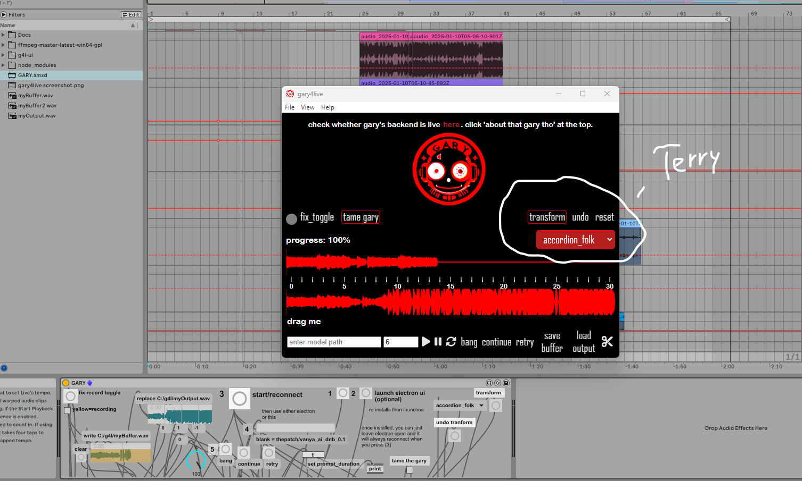
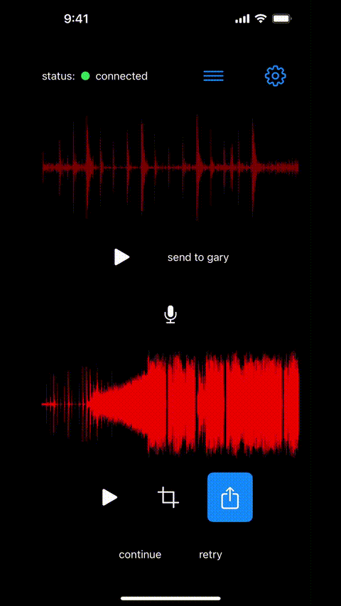

# gary

This repository serves as the backend for three applications: **gary-on-the-fly**, **gary4live**, and **gary4beatbox**. 

# mega update - jan 12 2025

we have a new model inside gary4live thanks to meta. it's in the /melodyflow folder.



we use the modified audiocraft repo at https://huggingface.co/spaces/facebook/melodyflow 

since the official audiocraft repo hasn't been updated yet, we created a separate environment for the /transform endpoint. 

melodyflow, aka terry, takes input audio and transforms it into audio the same length. you can now take your audio, transform it, continue it with gary, and then transform it again. you can also just return a gary output (up to ~40 secs), and transform it, then have gary continue it again.

/melodyflow/variations.py has 'presets' inside it. those can be edited to whatever you want. we're still figuring out what works best but the ones we have so far are fun as hell.

terry spins up on port 8002, but you only need your m4l device to continue talking to port 8000 (inside commentedout.js of https://github.com/betweentwomidnights/gary4live)

# you will prolly need ~6gb of gpu ram to use terry locally.

## how to spin up the new docker-compose.yml

### This repo is a modified audiocraft repo that now attempts to use 'mps' as a device if you're on apple silicon. I'm just a p.c. boi so I haven't had the chance to test out the arm64 docker image yet.

if you're on apple silicon, instead of 
```bash
docker build -t thecollabagepatch/g4lwebsockets:latest -f Dockerfile.g4lwebsockets . 
```
run
```bash
docker build -t thecollabagepatch/g4lwebsockets:latest -f Dockerfile.g4lwebsockets_arm64 . 
```

everything else should work the same. 

please join the discord https://discord.gg/VECkyXEnAd and let me know how this goes on apple silicon. It's important to me that anyone can run our backend locally. 

Note:
- I edited `/audiocraft/encodec.py` and `/audiocraft/musicgen.py` to try and get 'mps' working for musicgen continuations.
- `/melodyflow/audiocraft/models/melodyflow.py` apparently already has 'mps' as a possible device it can use. 
- The mac front-end can be built using https://github.com/betweentwomidnights/gary-mac

1. install wsl and docker-desktop

https://www.docker.com/products/docker-desktop/ (it's free)

2. install docker-compose:
```bash
pip install docker-compose
```
(the exact way you get docker-compose installed isn't super important. there's a few different ways to do it)
3. in the terminal:
```bash
wsl
git clone https://github.com/betweentwomidnights/gary-backend-combined
cd gary-backend-combined
docker build -t thecollabagepatch/g4lwebsockets:latest -f Dockerfile.g4lwebsockets .
docker build -t thecollabagepatch/redis:latest -f Dockerfile.redis .
cd melodyflow
docker build -t thecollabagepatch/melodyflow:latest -f Dockerfile.melodyflow .
cd ..
docker-compose up -d
docker-compose logs -f
```

(note: depending on your install, the docker-compose commands may be 'docker compose' without the '-' )

you should see the containers run after a few seconds of irrelevant warnings.

done! if you have trouble installing docker-compose, just ask claude (lol).

hit me up in the discord for any help 

---

# TODO - cleanup old readme below

the gary_docs folder has a bunch of random stuff in it that you can probably ignore.

### gary4live (g4lwebsockets)

**gary4live** is a max for live device that enables musicgen continuations inside ableton. there's no text prompting here. instead, think of each fine-tune as a "preset" in the vst.

#### backend for gary4live

we have servers running to host the backend, but if you're chad enough and want one all to yourself, the backend for running **gary4live** on its own is defined in the `docker-compose-g4lwebsockets.yml` file. this will spin up the docker-compose without terry.

just rename this file to `docker-compose.yml` in order to run it. you can rename the existing `docker-compose.yml` to something else for now.

**gary4beatbox** is an ios/android app that uses the same backend as **gary4live** 

https://apps.apple.com/us/app/gary4beatbox/id6736522400

if our backend goes down, it's totally doable to use this docker-compose with zrok or ngrok and to input the backend url in your settings inside gary4beatbox. 



### gary-on-the-fly and gary4web (concurrent_gary)


#### a note: this was the first version of gary i made a front-end for. ever since incorporating gary into ableton, that's now the one i use. it gives you alot more control as a musician. i still need to finish making the front-end noice for this one. the gary4web front-end is more finished.

this backend (`dockerfile.concurrent_gary`) is for the browser extension known as gary-on-the-fly. it uses yt-dlp in combination with the timestamp of the user's current youtube.com/watch url to do a musicgen continuation. then, the generations can be extended/cropped and arranged in the newtab component.

the front-end for gary-on-the-fly is [here](https://github.com/betweentwomidnights/gotf-frontend.git).

there's also a web app at https://thecollabagepatch.com (go to gary's page and click gary4web. it is currently offline due to compute resources). i still need to push the web app front-end to github. gary4web uses the `concurrent_gary` setup.

  ```sh
  mv docker-compose-concurrent_gary.yml docker-compose.yml
  sudo docker build -t thecollabagepatch/concurrent_gary:latest -f dockerfile.concurrent_gary .
  sudo docker build -t thecollabagepatch/redis:latest -f dockerfile.redis .
  cd express-server
  sudo docker build -t thecollabagepatch/express-server:latest -f dockerfile .
  
  cd gary-backend-combined
  
  sudo docker-compose up
  ```

a third backend exists for a multi-gpu setup that uses both docker images. it's in the `old_random_backup_scripts` folder.

any fine-tunes hosted on huggingface can be used in both backends.

fun fact: https://twitter.com/@thepatch_gary uses the `concurrent_gary` docker-compose to perform youtube continuations inside twitter. i run gary-andreessen locally. it accepts a @ (mention) with a youtube url + timestamp on twitter and returns an audiovisual continuation that you can THEN reply to him with the word 'continue' and have him pick up where he left off.

https://github.com/betweentwomidnights/gary-andreessen (this is an absurd side project that uses a local llama to scrape clips of marc andreessen talking on youtube and 'continue' them as insane jungle drums with automated audio visual glitch fx and formulated tweet text. he's kinda stupid and still being born)

### train-gary

we have pushed the **train-gary** container which is used to create fine-tunes for gary using the audiocraft repository. there are several scripts in this module:

- `from_scratch.py`: accepts a youtube playlist as input and generates a dataset for training. it uses demucs to strip the vocals, splits the audio into 30 second chunks, uses mtg-essentia to autolabel the files, and creates the jsons in the `/egs` folder so that you can simply run `train-gary.py` afterward.
- `review_chunks.py`: allows users to listen to the chunks and decide whether to keep them in the dataset. (still a work in progress)
- `add_chunks.py`: adds chunks to an existing dataset, either from a youtube playlist or audio files in the dataset. the user can choose whether to use demucs for vocal stripping. (work in progress)
- `fix_json.py`: ensures the dataset jsons correspond to actual audio files and removes duplicates. useful after running `review_chunks.py`. (work in progress)
- `train-gary.py`: this script runs a training session using the audiocraft repository with customizable settings.

the `from_scratch.py` and `train-gary.py` scripts have been tested extensively. the others are still works in progress.

the training configuration is open to experimentation. you can use `adamw` or `dadam` as the optimizer, where `dadam` should have a learning rate of 1, and `adamw` can use other learning rates. lyra's original notebook used `lr1-e4`, but it remains an open question for continuation training.

training a gary model tends to work best with electronic music, possibly due to the dataset meta used to train the original models.

- **musicgen-small** can be trained on a t4 or equivalent with about 16gb of vram.
- **musicgen-medium** requires around 29gb of vram.


the most successful fine-tunes so far are:
- **vanya's thepatch/vanya_ai_dnb_0.1**
- **thepatch/bleeps-medium** (dataset curated by me and lyra)

**hoenn_lofi** is the only large fine-tune we've experimented with, and while it converges nicely, it runs slowly.

as a side note, we're exploring retraining the base model using the xcodec repository found [here](https://github.com/zhenye234/xcodec).

### gumroads

you can install the front-end for gary4live on pc or mac. it's probably easier that way honestly.

- gary4live gumroad links:
  - [PC version](https://thepatch.gumroad.com/l/gary4live)
  - [Mac version](https://thepatch.gumroad.com/l/gary-mac)


### i am/was a newb when i first made this repo. it should have been a fork of audiocraft, but i biffed that. i literally merge this repo by hand when audiocraft gets updated. it's actually kinda fun seeing every single line that gets changed.

# AudioCraft


AudioCraft is a PyTorch library for deep learning research on audio generation. AudioCraft contains inference and training code
for two state-of-the-art AI generative models producing high-quality audio: AudioGen and MusicGen.


## Installation
AudioCraft requires Python 3.9, PyTorch 2.1.0. To install AudioCraft, you can run the following:

```shell
# Best to make sure you have torch installed first, in particular before installing xformers.
# Don't run this if you already have PyTorch installed.
python -m pip install 'torch==2.1.0'
# You might need the following before trying to install the packages
python -m pip install setuptools wheel
# Then proceed to one of the following
python -m pip install -U audiocraft  # stable release
python -m pip install -U git+https://git@github.com/facebookresearch/audiocraft#egg=audiocraft  # bleeding edge
python -m pip install -e .  # or if you cloned the repo locally (mandatory if you want to train).
python -m pip install -e '.[wm]'  # if you want to train a watermarking model
```

We also recommend having `ffmpeg` installed, either through your system or Anaconda:
```bash
sudo apt-get install ffmpeg
# Or if you are using Anaconda or Miniconda
conda install "ffmpeg<5" -c conda-forge
```

## Models

At the moment, AudioCraft contains the training code and inference code for:
* [MusicGen](./docs/MUSICGEN.md): A state-of-the-art controllable text-to-music model.
* [AudioGen](./docs/AUDIOGEN.md): A state-of-the-art text-to-sound model.
* [EnCodec](./docs/ENCODEC.md): A state-of-the-art high fidelity neural audio codec.
* [Multi Band Diffusion](./docs/MBD.md): An EnCodec compatible decoder using diffusion.
* [MAGNeT](./docs/MAGNET.md): A state-of-the-art non-autoregressive model for text-to-music and text-to-sound.
* [AudioSeal](./docs/WATERMARKING.md): A state-of-the-art audio watermarking.
* [MusicGen Style](./docs/MUSICGEN_STYLE.md): A state-of-the-art text-and-style-to-music model.

## Training code

AudioCraft contains PyTorch components for deep learning research in audio and training pipelines for the developed models.
For a general introduction of AudioCraft design principles and instructions to develop your own training pipeline, refer to
the [AudioCraft training documentation](./docs/TRAINING.md).

For reproducing existing work and using the developed training pipelines, refer to the instructions for each specific model
that provides pointers to configuration, example grids and model/task-specific information and FAQ.


## API documentation

We provide some [API documentation](https://facebookresearch.github.io/audiocraft/api_docs/audiocraft/index.html) for AudioCraft.


## FAQ

#### Is the training code available?

Yes! We provide the training code for [EnCodec](./docs/ENCODEC.md), [MusicGen](./docs/MUSICGEN.md) and [Multi Band Diffusion](./docs/MBD.md).

#### Where are the models stored?

Hugging Face stored the model in a specific location, which can be overridden by setting the `AUDIOCRAFT_CACHE_DIR` environment variable for the AudioCraft models.
In order to change the cache location of the other Hugging Face models, please check out the [Hugging Face Transformers documentation for the cache setup](https://huggingface.co/docs/transformers/installation#cache-setup).
Finally, if you use a model that relies on Demucs (e.g. `musicgen-melody`) and want to change the download location for Demucs, refer to the [Torch Hub documentation](https://pytorch.org/docs/stable/hub.html#where-are-my-downloaded-models-saved).


## License
* The code in this repository is released under the MIT license as found in the [LICENSE file](LICENSE).
* The models weights in this repository are released under the CC-BY-NC 4.0 license as found in the [LICENSE_weights file](LICENSE_weights).


## Citation

For the general framework of AudioCraft, please cite the following.
```
@inproceedings{copet2023simple,
    title={Simple and Controllable Music Generation},
    author={Jade Copet and Felix Kreuk and Itai Gat and Tal Remez and David Kant and Gabriel Synnaeve and Yossi Adi and Alexandre Défossez},
    booktitle={Thirty-seventh Conference on Neural Information Processing Systems},
    year={2023},
}
```

When referring to a specific model, please cite as mentioned in the model specific README, e.g
[./docs/MUSICGEN.md](./docs/MUSICGEN.md), [./docs/AUDIOGEN.md](./docs/AUDIOGEN.md), etc.
